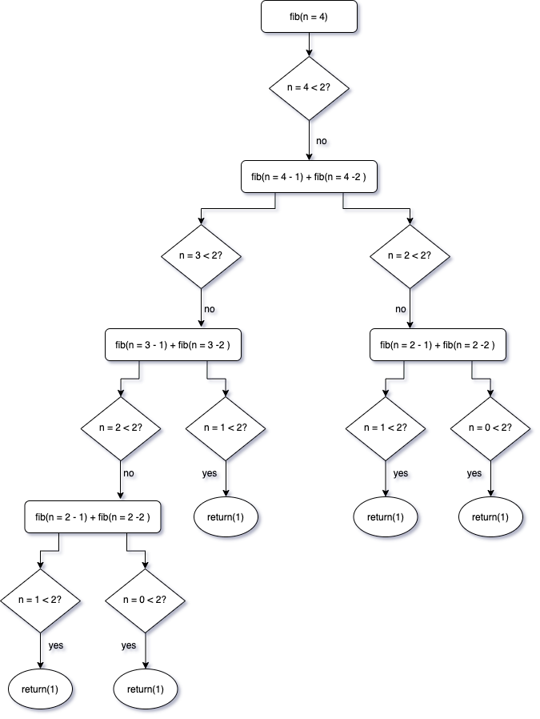

```{r setup, include=FALSE}
knitr::opts_chunk$set(echo = TRUE)
knitr::opts_chunk$set(comment = NA)
knitr::opts_chunk$set(warning = FALSE)
library(purrr)
library(memoise)
library(magrittr)
options(digits = 4)
```

# Introduction

A **function operator** is a function that takes one or more functions as input and returns a function as output. Function operators are essentially function factories that take functions as inputs. These are also known as **decorators** in Python. 

# Capturing errors with purrr::safely()

The implementation of `purrr::safely`, in its simplest form, is carried out as follows:

```{r, eval=FALSE}
simple_safety <- function(expr) {
  tryCatch(
    error = function(cnd) {
      # If expr fails, results in NULL and error contains the error condition object
      list(result = NULL, error = cnd)
    },
    # If expr succeeds, result will be expr and error will be NULL
    list(result = expr, error = NULL)
  )
}
```

In other words, `purrr::safely()` is a function operator that transforms a function to turn errors into data. A motivating example is as follows:

```{r}
# Vector
x <- list(
  c(2, 3, 4, 5),
  c(2, 3, 4, 3),
  c(3, 4, 5, 2),
  "error"
)
```

If we apply the `sum()` function to each object that the list references, we will receive an error due to the fact that the fourth element references a string object from the global string pool. However, we can still examine the output up to the failure:

```{r, eval=FALSE}
# Initialize output container
out <- rep(x = NA_real_, times = length(x))
# Loop
for (i in seq_along(x)) {
  out[[i]] <- sum(x[[i]])
}
out
# 14 12 14 NA
```

The same cannot be done with functionals:

```{r, eval=FALSE}
map_dbl(.x = x, .f = sum)
# Error in .Primitive("sum")(..., na.rm = na.rm) : invalid 'type' (character) of argument
```

We can use `purrr::safely()` to overcome this problem:

```{r}
safe_sum <- safely(.f = sum, otherwise = NULL, quiet = TRUE)
```

In this instance, `purrr::safely()` takes a function and return a wrapped function. The argument `otherwise` specifies the default value to use when an error occurs and `quite = TRUE` hides errors rather than displaying them as they occur:

```{r}
out <- map(.x = x, .f = safe_sum)
str(out)
```

Next, we can use `purrr::transpose()` to turn the output inside-out so that we have a list of results and a list of errors:

```{r}
out <- transpose(.l = out, .names = NULL)
str(out)
```

Now we can find the results that worked and those that failed:

```{r}
# Create an index for failures
failed <- map_lgl(.x = out[["result"]], .f = is.null)
failed
# Subset to find the failed iteration
x[failed]
# Subset to find all successful iterations
out[["result"]][!failed]
```

---

# Caching computations with memoise::memoize()

In computing, memoization is an optimization technique used primarily to speed up computer programs by storing the results of expensive function calls and returning the cached result when the same inputs occur again. A memoized function can run faster, but since it stores all previous inputs and outputs, it uses more memory. There is a trade-off between memory and speed. A relatively realistic use of memoization is computing the Fibonacci Sequence: 

\begin{align*}
0,1,1,2,3,5,8,13,21,34, \ldots
\end{align*}

The next number is found by adding up the two numbers before it:

* the 2 is found by adding the two numbers before it $(1+1)$,
* the 3 is found by adding the two numbers before it $(1+2)$
* the 5 is $(2+3)$
* and so on!

So we can write the rule:

\begin{align*}
\mathbf{x}_{\mathbf{n}}=\mathbf{x}_{\mathbf{n}-\mathbf{1}}+\mathbf{x}_{\mathbf{n - 2}}
\end{align*}

where:

* $\mathbf{x}_{\mathbf{n}}$ is term number $n$
* $\mathbf{x}_{\mathbf{n}-\mathbf{1}}$ is the previous term $(\mathrm{n}-1)$
* $\mathbf{x}_{\mathbf{n}-\mathbf{2}}$ is the term before that $(\mathrm{n}-2)$

The naive implementation could be slow:

```{r}
# Naive implementation using a recursive function
fib <- function(n) {

  # If n is less than 2, simply return 1
  if (n < 2) {
    return(1)
  }

  # If n is greater than 2, then use the rule
  fib(n - 1) + fib(n - 2)
}
```

The flow for `fib(n = 4)` can be charted as follows. Notice that `fib(n=2-1)` and `fib(n=2-2)` are computed twice:

```{r, fig.align='center', out.width="80%", echo=FALSE}

```

Let us time it:

```{r}
# Recursion is a rather expensive operation
fib(5) %>% system.time()
fib(23) %>% system.time()
fib(30) %>% system.time()
```

In the naive implementation, there are many computations, which become increasingly expensive as $n\to\infty$. For instance, for `fib(10)`, `fib(9)` and `fib(8)` are computed; for `fib(9)`, `fib(8)` and `fib(7)` are computed, so on and so forth. The computation for `fib(8)` is carried out twice. Now, memoizing `fib()` makes the implementation much faster since each value `f(n)` is computed only once and stored.

```{r}
fib2 <- memoize(
  f = function(n) {
    if (n < 2) {
      return(1)
    }
    fib2(n - 1) + fib2(n - 2)
  }
)
```

Not the implementation is much faster:

```{r}
fib2(30) %>% system.time()
fib2(31) %>% system.time()
fib2(40) %>% system.time()
```

---

# possibly()

These functions wrap functions so that instead of generating side effects through printed output, messages, warnings, and errors, they return enhanced output. They are all adverbs because they modify the action of a verb (a function):

* `safely(.f, otherwise = NULL, quiet = TRUE)`

* `quietly(.f)`

* `possibly(.f, otherwise, quiet = TRUE)`

* `auto_browse(.f)`

```{r}
# To replace errors with a default value, use possibly()
list("a", 10, 100) %>%
  map_dbl(
    .x = .,
    .f = possibly(.f = log, otherwise = NA_real_, quiet = TRUE)
  )
```

Here is the source code:

```{r}
possibly
```

The function `possibly()` internally uses `purrr::as_mapper()`. This enables users to supply not only functions, but also formulas or atomics via the same syntax as known from other functions in the purrr package. Besides this, the new default value `otherwise` gets evaluated once using `force()` to make it (almost) immutable. The implementation of `possibly()` uses `tryCatch()`, which creates an exiting handler that captures the condition object if `.f(...)` signals a condition, i.e., throw an error. The exiting handler then returns the value `otherwise`, which is specified by the user. 

---

# safely()

The source code of `safely()` is as follows:

```{r}
safely
```

To understand the implementation, we need to examine `purrr:::capture_error()`:

```{r}
purrr:::capture_error
```

In other words, `capture_error()` is very similar to the pattern:

```{r, eval=FALSE}
function(code, otherwise) {
  tryCatch(
    # If expr succeeds, result will be expr and error will be NULL
    list(result = code, error = NULL),
    # Exiting handler that captures the condition object signaled by expr
    error = function(e) {
      # If expr fails, results in NULL and error contains the error condition object
      list(result = otherwise, error = e)
    }
  )
}
```
