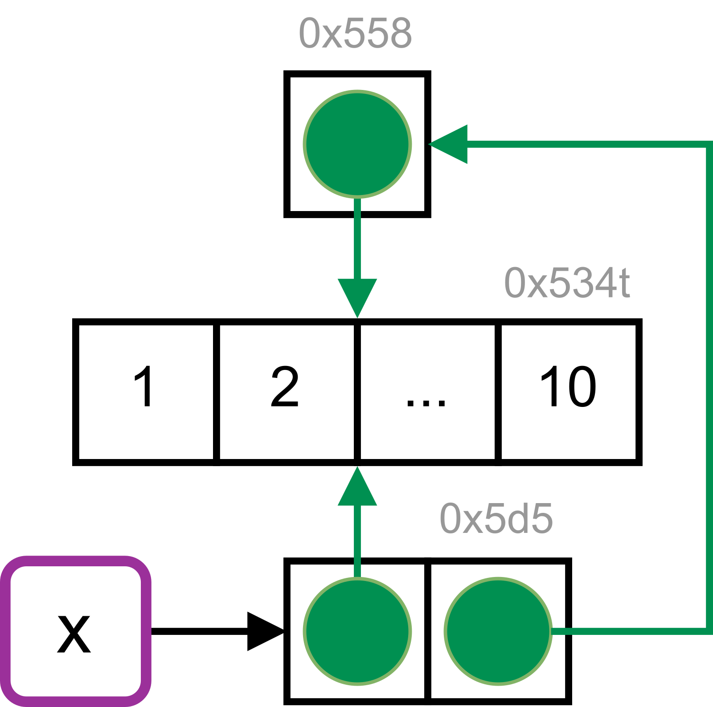

```{r setup, include=FALSE}
knitr::opts_chunk$set(echo = TRUE)
knitr::opts_chunk$set(warning = FALSE)
knitr::opts_chunk$set(comment = NA)
knitr::opts_chunk$set(collapse = TRUE)
library(lobstr)
library(ggplot2)
library(bench)
```

## Exercises

### Exercise 1

```{r, collapse = TRUE}
# Objects
a <- 1:10
b <- a
c <- b
d <- 1:10
# Access object identifier
cat(obj_addr(a))
cat(obj_addr(b))
cat(obj_addr(c))
cat(obj_addr(d))
# Check if same
cat(identical(obj_addr(a), obj_addr(b)))
cat(identical(obj_addr(a), obj_addr(c)))
cat(identical(obj_addr(a), obj_addr(d)))
```

**My solution:** In the first line, an object, which is a numeric sequence from 1 to 10, is created and it is bound to the name "a" using the <- operator. In the second line, R creates another binding from the name "b" to the already existing numeric sequence. Note that R does not create another copy of the sequence (memory efficient) but only adds another name reference to the same value. In the third line, R creates another binding to the existing numeric sequence from the name "c". In the last line, R creates another copy of the numeric sequence and R is binding the numeric sequence to a name "d".   

**Textbook:** "a","b", and "c" point to the **same object (with the same address in memory).** This object has the value 1:10. "d" points to a different object with the same value, but with different address in the memory.

---

### Exercise 2

```{r, collapse = TRUE}
# Create a list containing the functions
mean_functions <- list(
  mean,
  base::mean,
  get("mean"),
  evalq(mean),
  match.fun("mean")
)
# Check for unique address
cat(unique(obj_addrs(mean_functions)))
```

The following code all point to the same underlying function object with the same address in memory.

---

###Exercise 3

```{r,eval=FALSE}
read.csv(check.names = FALSE)
```

**Textbook:** Column names are often data, and the underlying make.names() transformation argument in the function read.csv() is non-invertible, so the default behavior corrupts data. To avoid this, set the argument check.names = FALSE in the function read.csv().

---

### Exercise 4

A **syntactically** valid name consists of letters, numbers and the dot or underline characters and starts with a letter or the dot. If it starts with dot, it must not be followed by a number. Names such as ".2way" are not valid, and neither are the **reserved** words. The rules that make.names() uses to convert non-syntactic names into syntactic ones are:

* Names that do not start with a letter or a dot will be prepended with an "X". The same holds for names that begin with a dot followed by a number.

```{r, collapse=TRUE}
cat(make.names("3")) # prepending "X"
cat(make.names(".3")) # prepending "X"
```

* All invalid characters are translated to "."

```{r, collapse=TRUE}
cat(make.names("#")) # prepending "X" + "." replacement
cat(make.names("  ")) # prepending "X" + ".." replacement
cat(make.names("non-valid")) # "." replacement for "-"
```

* Names that match R keywords are suffixed/appended by a dot

```{r, collapse=TRUE}
cat(make.names("NULL")) # "." suffix
```

* A missing value is translated to "NA"

* The definition of a letter depends on the current locale, but only American Standard Code for Information Interchange digits are considered to be digits

---

### Exercise 5 

A syntactic name must start with either a letter or the dot and must not be followed by a number. The name ".123e1" is not a syntactic name. In fact, .123e1 makes it a double = 1.23.

```{r}
cat(make.names(".123e1")) # prepending with "X"
```

---

## Copy-on-modify

```{r}
# Bind x and y to the same underlying value
x <- c(1, 2, 3)
y <- x
# Modify the 3rd element of y
y[[3]] <- 4
# View x, which is unchanged
cat(x)
# Identifiers
cat(obj_addr(x))
cat(obj_addr(y))
```

**What's happening:** R creates a new object, with address cat(obj_addr(x)), a copy of object cat(obj_addr(y)), with the third element changed, then rebind y to that object. This is called **copy-on-modify**. A related way to describe this behavior is to say that R objects are unchangeable, or **immutable**.

---

## tracemem()

```{r}
# Bind value x
x <- c(1, 2, 3)
# Trace x
cat(tracemem(x))
# Bind the same value to y
y <- x
# Modify y
y[[3]] <- 4L
# Modify y again
y[[3]] <- 5L
# Untrace
untracemem(y)
```

**What's happening:** When modifying y again, it won't get copied since the new object now only has a single name "y" bound to it; R applies modify-in-place optimization instead of copy-on-modify.

---

## Function calls

```{r}
# Function
f <- function(a) {
  a[[3]] <- 5L
}
# Bind value to x and trace
x <- c(1, 2, 3)
cat(tracemem(x))
# Bind the object created by the function to z
z <- f(x)
# Untrace
untracemem(x)
```

**What's happening:** Since f() modifies the object referenced by x, the object gets copied and this new object's third element is modified. "z", then, binds this new object.

---

## Lists

```{r}
# Create a list
l1 <- list(1, 2, 3)
# Bind the same list object to l2
l2 <- l1
# Proof
obj_addr(l1)
obj_addr(l2)
# Modify list
l2[[3]] <- 4
# Values shared across lists
ref(l1, l2)
```

A list stores the values of each element and the references/bindings to those values. When an element in a list is modified, a **shallow** modified copy is created. That is, the list object and its bindings are copied, but the value objects pointed to by the bindings are not copied. The opposite is a deep copy, which, prior to R 3.1.0, copies were always deep copies. As can be seen, the values(1 and 2) bound by the first two elements of both lists are not copied; both lists share these values. For the third element of l2, a new object is created for the value(4) it binds. Now, there are a total of four values/objects with four unique "addresses."

---

### Why should we pre-allocate output containers when iterating?

Examine the example below. Using `c()`, `append()`, `cbind()`, `rbind()`, `paste()`, or modifying an object using `x[[i]] <- y` can create copies in a for loop. 

```{r}
# Instantiate an empty list
y <- list()
# For loop
for (i in 1:10) {
  y[[i]] <- i
  cat(lobstr::obj_addr(y), "\n")
}
```

As can be seen,  in each iteration, R creates a new copy and rebind y to the new modified object. This pattern holds for other types of operations such as `y <- append(y, i)`. This is because R must first allocate space for the new object and then copy the old object to its new home. This will be quite expensive when the number of iterations is high. However, if we pre-allocate an output container, we can avoid the copying behavior:

```{r}
# Pre-allocate empty container
y <- vector(mode = "list", length = 10)
# For loop
for (i in seq_along(y)) {
  y[[i]] <- i
  cat(lobstr::obj_addr(y), "\n")
}
```

---

## Data Frames

Data frames are lists of vectors.

```{r}
# Create a 3x2 data frame
d1 <- data.frame(x = c(1, 5, 6), y = c(2, 4, 3))
# Identifiers
cat(obj_addr(d1))
cat(obj_addr(d1$x))
cat(obj_addr(d1$y))
# Bind same data frame object to d2
d2 <- d1
# Proof
cat(obj_addr(d2))
cat(obj_addr(d2$x))
cat(obj_addr(d2$y))
# Modify second column of data frame 2
d2[, 2] <- d2[, 2] * 2
# Shared objects
ref(d1, d2)
```

Notice that only the second column needs to be modified; the others will still point to their original references.

```{r}
# Bind original data frame object to d3
d3 <- d1
# Proof
cat(obj_addr(d3))
cat(obj_addr(d3$x))
cat(obj_addr(d3$y))
# Modify first row of data frame 3
d3[1, ] <- d3[1, ] * 3
# Shared objects
ref(d1, d3)
```

Notice, when a row is modified, both columns of d1 are copied and modified; d3 has two new objects bound to x and y (or, equivalently, referenced/pointed to by x and y).

---

## Charater vectors

R uses a **global string pool** where each element of a character vector is a pointer to a unique string int he pool:
```{r, out.height="30%", out.width="30%", fig.cap="The Global String Pool"}
# Import image
knitr::include_graphics("Global string pool.png")
```
```{r}
# Create a character vector and bind it to x
x <- c("a", "a", "abc", "d")
# Identifiers
cat(obj_addr(x))
cat(ref(x, character = TRUE))
```

---

## Exercises

### Exercise 1

```{r}
# Identifier
cat(obj_addr(1:10)) # the object exists, but has no name
```

**Textbook:** When 1:10 is called an object with an address in memory is created, but it is not bound to a name. Therefore, the object cannot be called or manipulated from R. As no copies will be made, it is not useful to track the object for copying.

---

### Exercise 2

```{r}
# Create a vector and bind it to x
x <- c(1L, 2L, 3L)
# Trace
cat(tracemem(x))
# Modify
x[[3]] <- 4
```

**Textbook:** Initially the vector x has integer type. The replacement call assigns a double(4) to the third element of x, which triggers copy-on-modify. We can avoid the copy by sub-assigning an integer instead of a double:

```{r}
# Create a vector and bind it to x
x <- c(1L, 2L, 3L)
# Trace
cat(tracemem(x))
# Modify
x[[3]] <- 4L
```

---

### Exercise 3

```{r}
# Create objects
a <- 1:10
b <- list(a, a)
c <- list(b, a, 1:10)
# Trees of references
ref(a)
ref(b)
ref(c)
```

**My solution:** The first line creates a value (aka a numeric sequence) and binds it to the name "a" with address a. The second line creates a list object, which stores the numeric sequence and the references to them, and binds the list object to the name "b", which has a new address b. The two elements in "b" references/point to the same value pointed to by "a". The last line creates a list object and binds it to the name "c" with address c; elements in c has bindings to the same object as b and a and also a new object, which is the numeric sequence 1:10 that has a address d. There are a total of 4 objects, since there are 4 unique addresses.

**Textbook:** "a" contains a reference to an address with the value 1:10. "b" contains a list of two references to the same address as "a". "c" contains a list of "b" (containing two references to a), "a" (containing the same reference again) and a reference pointing to a different address containing the same value (1:10).

```{r, out.height="30%", out.width="30%", fig.cap="Tree"}
# Import image
knitr::include_graphics("Reference Tree.png")
```

```{r}
ref(c)
# c
# - b
# -- a
# -- a
# - a
# - 1:10
```

---

### Exercise 4

```{r}
# Create a list and bind it to x
x <- list(1:10)
# Reference Tree
ref(x)
```

The initial reference tree of x shows that the name x binds to a list object with an address. This object contains a reference to the integer vector 1:10, which has an address.

```{r}
# Trace
cat(tracemem(x))
# Modify list as x is assigned to the second element of itself
x[[2]] <- x
```

Here, a modified copy of the list is made; however, it is a shallow copy since the integer vector is not copied. The list object previously bound to x is now referenced in the newly created list object. It is no longer bound to a name. The integer vector is referenced twice:

```{r}
# Reference Tree
ref(x)
```

```{r, out.height="30%", out.width="30%", fig.cap="Tree"}
# Import image

``` 

---

## Object Size

```{r}
# Create a vector value and bind it to x
x <- runif(1e6)
# Identifier
cat(obj_addr(x))
# Size
obj_size(x)
# Create a list and bind it to y
y <- list(x, x, x)
# Identifier
cat(obj_addr(y))
# Reference Tree
ref(y)
# Size
obj_size(y)
```

Since the elements of lists are references to values, the size of a list might be much smaller than expected. Furthermore, obj_size(x) + obj_size(y) will only equal obj_size(x,y) if there are no shared values. Notice "y" is only 80 bytes bigger than x, which is the size of an empty list with three elements:

```{r}
# Empty list
obj_size(list(NULL, NULL, NULL))
```

```{r}
# Character vector
banana <- "bananas bananas bananas"
# Size
obj_size(banana)
obj_size(rep(banana, 100))
```

**Alternative Representation:** Instead of storing every single number in the sequence, R just stores the first and last number, meaning every sequence, no matter how large, is the same size:

```{r}
obj_size(1:3)
obj_size(1:1e3)
obj_size(1:1e6)
obj_size(1:1e9)
```

---

## Exercises

### Exercise 1

```{r}
# Create an list object and bind it to y
# list(runif(1e4)) creates a list of 1 element, which references a double vector
# rep() creates a list where each element is the aforementioned list of 1 element
y <- rep(list(runif(1e4)), 100)
# Sizes
obj_size(y)
object.size(y)
```

The function object.size() does not detect if elements of a list are shared, and so it overstates the object size. The original list object has the address `r obj_addr(y[[1]])` and size `r obj_size(y[[1]])`. The elements in the list "y" simply points to/references the same object the original list points to; it does not make a shallow copy of the original list since there is no modification. Therefore, the results differ by a factor of ~ 100. 

---

### Exercise 2

```{r}
# Create a list of functions and bind it to "funs"
funs <- list(mean, sd, var)
# Individual Size
obj_size(mean)
obj_size(sd)
obj_size(var)
# Size of list containing these functions
obj_size(funs)
```

It is somewhat misleading, because all three functions are built-in to R as part of the base and stats packages and hence always available. 

---

### Exercise 3

**My solutions:**

```{r}
a <- runif(1e6)
tracemem(a)
# Size
obj_size(a)
```

**Prediction for a:** 8,000,048 B. The textbook solution below explains further how this number comes about.

```{r}
b <- list(a, a)
# Size
obj_size(b)
obj_size(a, b)
# Reference tree
ref(a, b)
```

**Prediction for b:** 8,000,048 B (size of "a") + 64 B (size of an empty list with two elements) = 8,000,112 B

**Prediction for (a,b):** This should be same as size of "b" since "a" and "b" have shared values so no addition memory is needed to store new objects

```{r}
b[[1]][[1]] <- 10
# Size
obj_size(b)
obj_size(a, b)
# Reference tree
ref(a, b)
```

**Prediction for b:** The new "b" should have double the size of "a" since a modified copy of "a" is made plus the size of an empty list with two elements 64 B; therefore, = 16,000,160 B

**Prediction for (a,b):** This should simply be the size of the new "b" (16,000,160 B). Since "a" references the numeric vector runif(1e6) already in existent, it does not need a new memory address. The first element of "b" is modified and the increase in object size is reflected in size of the new "b". The second element of b, which is "a", also references that existing vector; hence, there is no additional memory needed for the second element of the new "b"

```{r}
b[[2]][[1]] <- 10
# Size
obj_size(b)
obj_size(a, b)
# Reference tree
ref(b)
# Reference tree
ref(a, b)
```

**Prediction for b:** The object size of this new "b" should be 16,000,160 B since modifying the second element of the previous "b" triggers copy-on-modify. As can be seen in the reference tree for this new "b", there are two memory addresses that the two elements in "b" reference/point to. Each of those vector values should have an object size of "a", 8,000,048 B; two of them should have 8,000,048 B * 2 + 64 B = 16,000,160 B.

**Prediction for (a,b):** ~ Triple the size of "a" since we have one memory address associated with "a" and the two elements in list "b" point to two memory addresses. We have one element pointing to the modified numeric vector b[[1]][[1]] <- 10 and another pointing to the modified numeric vector b[[2]][[1]] <- 10. The total object size should be 


**textbook:** In R (on most platforms) a length-0 vector has 48 bytes of overhead:

```{r}
obj_size(list())
obj_size(double())
obj_size(character())
```

A single double takes up additional 8 bytes of memory:

```{r}
obj_size(double(1))
obj_size(double(2))
```

So, a 1 million double should take up 8,000,048 bytes. This is the object size of "a".

---

## Modify-in-place

* Objects with a single binding get a special performance optimization; modifying does not create a copy of the object. R modifies the object, which then takes the place of the original object. However, there is a problem when trying to prove this in R. Check: <https://github.com/hadley/adv-r/issues/1025>
```{r}
# Create a data frame with 10,000 rows
x <- data.frame(matrix(runif(5 * 1e4), ncol = 5))
# Trace
cat(tracemem(x))
# A vector of column medians
medians <- vapply(X = x, FUN = median, FUN.VALUE = numeric(1))
```

Here, vapply() will loop a function through data in a list or vector. vapply( ) is similar to sapply, but it requires you to specify what type of data you are expecting. The arguments for vapply() are vapply(X, FUN, FUN.VALUE). FUN.VALUE is where you specify the type of data you are expecting. I am expecting each item in the list to return a single numeric value, so FUN.VALUE = numeric(1).

```{r}
# For loop that is very slow since three copies are made per iteration
for (i in seq_along(along.with = medians)) {
  x[[i]] <- x[[i]] - medians[[i]]
}
# Untrace
untracemem(x)
```

Here, seq_along() generate regular sequences as it is a very fast primitive. seq_along(along.with) where along.with = take the length from the length of this argument. We can reduce the number of copies by using a list instead of a data frame:

```{r}
# Convert from data frame to list
y <- as.list(x)
# Trace
cat(tracemem(y))
# For loop (faster)
for (i in 1:5) {
  y[[i]] <- y[[i]] - medians[[i]]
}
```

---

## Environment

* Environments, a special type of object, are always modified in place. This is called reference semantics since when you modify an environment all existing bindings to that environment continue to have the same reference.

```{r}
# Create a new environment and bind it to e1
e1 <- rlang::env(a = 1, b = 2, c = 3)
# Bind it to a new name e2
e2 <- e1
# Addresses
cat(obj_addr(e1))
cat(obj_addr(e2))
# Modify
e1$c <- 4
# Check what happens to e2
cat(e2$c)
```

Notice that there isn't a modified copied made since modifying e1 also modifies e2, which points to the same underlying environment object.

---

## Exercises

### Exercise 1

**textbook:** In this situation copy-on-modify prevents the creation of a circular list:

```{r}
# creates initial object
x <- list()
# Object address
cat(obj_addr(x))
# Trace
tracemem(x)
# Copy-on-modify triggers new copy
x[[1]] <- x
# Copied object has new memory address
cat(obj_addr(x))
# list element contains old memory address
cat(obj_addr(x[[1]]))
```

---

### Exercise 2

First, we define a function to create some random data.

```{r}
# Function
create_random_df <- function(nrow, ncol) {
  random_matrix <- matrix(runif(nrow * ncol), nrow = nrow)
  as.data.frame(random_matrix)
}
# Create Data frame
create_random_df(2, 2)
```

Next, we wrap the two approaches to subtract numerical values (in our case medians) from each column of a data frame in their own function. We name these functions depending on whether the approach operates on a data frame or a list. For a fairer comparison, the second function also contains the overhead code to convert between data frame and list objects.

```{r}
# Function for data frame
subtract_df <- function(x, medians) {
  for (i in seq_along(medians)) {
    x[[i]] <- x[[i]] - medians[[i]]
  }
  x
}
# Function for list
subtract_list <- function(x, medians) {
  x <- as.list(x)
  x <- subtract_df(x, medians)
  as.data.frame.list(x)
}
```

This lets us profile the performance, via benchmarks on data frames with differing numbers of columns. Therefore, we create a small helper that creates our random data frame and its medians before it benchmarks the two approaches.

```{r}
# Function for finding the vector of medians
# given a randomly generated data frame
# then testing performance
benchmark_medians <- function(ncol) {
  df <- create_random_df(nrow = 1e4, ncol = ncol)
  medians <- vapply(df, median, numeric(1), USE.NAMES = FALSE)

  bench::mark(
    "data frame" = subtract_df(df, medians),
    "list" = subtract_list(df, medians)
  )
}
# Test
benchmark_medians(1)
```

The bench::press() function allows us to run our helper across a grid of parameters. We will use it to slowly increase the number of data frame columns in our benchmark.

```{r}
results <- bench::press(
  ncol = c(1000, 1500, 2000, 2500, 3000, 3500, 4000),
  benchmark_medians(ncol)
)
```

```{r}
ggplot(results, aes(ncol, median,
  col = attr(expression, "description")
)) +
  geom_point(size = 2) +
  geom_smooth() +
  labs(
    x = "Number of Columns",
    y = "Execution Time (s)",
    color = "Data Structure"
  ) +
  theme(legend.position = "top")
```

When working directly with the data frame, the execution time grows quadratically with the number of columns in the input data. This is because (e.g.) the first column must be copied n times, the second column n-1 times, and so on. When working with a list, the execution time increases only linearly.

Obviously in the long run, linear growth creates shorter run-times, but there is some cost to this strategy - we have to convert between data structures with as.list() and as.data.frame.list(). This means that the improved approach doesn’t pay off in this scenario until we get to a data frame that has a larger number of columns > 1000 (with the exact value depending on the characteristics of the system running the code).

---

### Exercise 3

```{r,eval=FALSE}
# Create a new environment and bind it to e1
e1 <- rlang::env(a = 1, b = 2, c = 3)
# Trace
tracemem(e1)
# Error in tracemem(e1) :
# 'tracemem' is not useful for promise and environment objects
```

The error occurs because “it is not useful to trace NULL, environments, promises, weak references, or external pointer objects, as these are not duplicated” (see ?tracemem). Environments are always modified in place.

---

## Unbinding and the garbage collector

```{r}
# Print a message to the console everytime gc is run
# gcinfo(True)
# Print total number of bytes used
mem_used()
```
