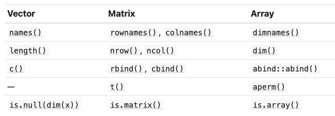

```{r setup, include=FALSE}
knitr::opts_chunk$set(echo = TRUE)
knitr::opts_chunk$set(warning = FALSE)
knitr::opts_chunk$set(comment = NA)
knitr::opts_chunk$set(collapse = TRUE)
library(lobstr)
library(tidyverse)
```

## Missing Vavlues

Use base::is.na() to test for the presence of missing values. Technically, there are four missing values, one of each of the atomic vectors: NA (logical), NA_integer_ (integer), NA_real_ (double), and NA_character_ (character). 

## Exercises

### Exercise 1

In R, scalars are represented as vectors of length one. However, there’s no built-in syntax like there is for logicals, integers, doubles, and character vectors to create individual raw and complex values. Instead, you have to create them by calling a function.

For raw vectors you can use either as.raw() or charToRaw() to create them from numeric or character values.
```{r}
cat(as.raw(23))
cat(typeof(as.raw(23)))
cat(charToRaw("A"))
cat(typeof(charToRaw("d")))
```

In the case of complex numbers, real and imaginary parts may be provided directly to the complex() constructor.
```{r}
cat(complex(length.out = 3, real = 23, imaginary = 98))
```
You can create purely imaginary numbers (e.g.) 1i, but there is no way to create complex numbers without + (e.g. 1i + 1).

---

### Exercise 2

Coercion rule: character $\rightarrow$ double $\rightarrow$ integer $\rightarrow$logical

```{r}
# Prediction: double vector
cat(typeof(c(1, FALSE)))
# Prediction: character vector
cat(typeof(c("a", 1)))
# Prediction: integer vector
cat(typeof(c(20L, TRUE)))
```

---

### Exercise 3

```{r}
cat(1 == "1")
cat(-1 < FALSE)
cat("one" < 2)
cat(99 == "99")
cat(99 < (TRUE * 100))
```

These comparisons are carried out by operator-functions (==, <), which coerce their arguments to a common type. In the examples above, these types will be character, double and character: 1 will be coerced to "1", FALSE is represented as 0 and 2 turns into "2" (and numbers precede letters in lexicographic order (may depend on locale)).

---

### Exercise 4

Why is the default missing value, NA, a logical vector? What is special about logical vectors? The presence of missing values should not affect the type of an object. Recall that there is a type-hierarchy for coercion from character to double to integer to logical. When combining NAs with other atomic types, the NAs will be coerced to integer (NA_integer_), double (NA_real_) or character (NA_character_) and not the other way round. If NA were a character and added to a set of other values all of these would be coerced to character as well.

```{r}
cat(typeof(NA))
cat(typeof(c(NA_character_, 2)))
cat(typeof(c(TRUE, NA)))
# Experiments
x <- c(TRUE, NA)
cat(typeof(x[2]))
x <- c(TRUE, NA_character_)
x[1]
cat(typeof(x[1]))
```


---

### Exercise 5

The documentation states that:

* is.atomic() tests if an object is an atomic vector (as defined in Advanced R) or is NULL (!).

* is.numeric() tests if an object has type integer or double and is not of class factor, Date, POSIXt or difftime.

* is.vector() tests if an object is a vector (as defined in Advanced R) or an expression and has no attributes, apart from names.(Note that is.vector() will return TRUE even when the input is a list; this is because vectors are defined as atomic vectors or lists.)

Atomic vectors are defined in Advanced R as objects of type logical, integer, double, complex, character or raw. Vectors are defined as atomic vectors or lists.

---

### Attributes

Atomic vectors have attributes. Attributes can be thought of as name-value pairs that attach metadata (i.e. data that describe data) to an object. Individual attributes can be retrieved and modified with base::attr(), or base::attributes(). 
```{r}
a <- 1:3
attributes(a)
attr(x = a, which = c("names")) <- c("abcdef", "haha", "igotit")
attr(x = a, which = "names")
attr(x = a, which = "dim")
attr(x = a, which = "names") <- NULL
attr(x = a, which = "names")
```
Here, the argument which is a non-empty character string specifying which attribute is to be accessed --- e.g., "dim," "name," or "x." The value argument to the right of the assignment operator can the new value of the attribute, i.e. a character vector, or NULL to remove the attribute.

---

Attributes are generally ephemeral. Most attributes are lost by most operations:
```{r}
attr(x = a, which = c("names")) <- c("abcdef", "haha", "igotit")
attributes(a[1])
attributes(sum(a))
```

The two attributes that are often preserved are 

* names, a character vector giving every element of a atomic vector a name
* dim, an integer vector used to turn vectors into matrices or arrays

---

### Names

The "names" is a character vector giving each element of a vector a name. Name vector in three ways:
```{r}
# When creating it
x <- c(I = 1, Love = 2, R = 3)
x
attributes(x)
structure(attributes(x))
str(attributes(x))
# By assigning a character vector to names()
x <- 2:5
names(x) <- c("3", "hey", "a", "lol")
x
attributes(x)
str(attributes(x))
# Inline with setNames()
x <- setNames(object = c("I", "Love", "Tableau"), nm = c("Do", "You", "Though"))
x
attributes(x)
str(attributes(x))
# Remove names attributes
unname(x)
names(x) <- NULL
```

Names should be unique, and non-missing, ideally. But, missing names my be either "" or NA_character_.

---

### Dimensions

Dimensions, an integer vector, used to turn vectors into matrices or arrays. An array in R can have one, two or more dimensions. It is simply a vector which is stored with additional attributes giving the dimensions (attribute "dim") and optionally names for those dimensions (attribute "dimnames"). A two-dimensional array is the same thing as a matrix.

```{r}
# Two scalar arguments specify row and column sizes
x <- matrix(data = 1:6, nrow = 2, ncol = 3)
x
str(x)
dim(x)
rownames(x)
t(x)
# One vector argument to describe all dimensions
y <- array(data = 1:12, dim = c(1, 3, 4))
y
str(y)
dim(y)
aperm(y)
# You can also modify an object in place by setting dim()
z <- 1:6
dim(z) <- c(3, 2)
z
str(z)
dim(z)
```

```{r, out.height="60%", out.width="60%", fig.cap="Useful Functions"}
# Import image

```

## 3.3.4 Exercises

### Exercise 1

```{r}
source_code_setNames <- function(object = nm, nm) {
  names(object) <- nm
  object
}
source_code_unname <- function(obj, force = FALSE) {
  if (!is.null(names(obj))) {
    names(obj) <- NULL
  }
  if (!is.null(dimnames(obj)) && (force || !is.data.frame(obj))) {
    dimnames(obj) <- NULL
  }
  obj
}
```

Function source code can be retrieved using View(). In addition, ! indicates logical negation (NOT). & and && indicate logical AND and | and || indicate logical OR.

---

### Exercise 2

```{r}
x <- 1:9
dim(x)
```

One may want to use NROW() or NCOL() to handle atomic vectors, lists and NULL values in the same way as one column matrices or data frames. For these objects nrow() and ncol() return NULL:
```{r}
# Return NULL
nrow(x)
ncol(x)
# Pretend it's a column vector
NROW(x)
NCOL(x)
```

---

### Exercise 3

```{r}
# A 1 dimensional vector
x <- 1:5
str(x)
dim(x)
# Five 1 by 1 matrices
x1 <- array(1:5, c(1, 1, 5))
x1
dim(x1)
# One 1 by 5 matrix
x2 <- array(1:5, c(1, 5, 1))
x2
dim(x2)
# One 5 by 1 matrix
x3 <- array(1:5, c(5, 1, 1))
x3
dim(x3)
```

These are all “one dimensional.” If you imagine a 3d cube, x1 is in the x-dimension, x2 is in the y-dimension, and x3 is in the z-dimension. In contrast to 1:5, x1, x2 and x3 have a dim attribute.

---

### Exercise 4

From ?comment: Contrary to other attributes, the comment is not printed (by print or print.default). Also, from ?attributes: Note that some attributes (namely class, comment, dim, dimnames, names, row.names and tsp) are treated specially and have restrictions on the values which can be set. We can retrieve comment attributes by calling them explicitly:

```{r}
foo <- structure(1:5, comment = "my attribute")
attributes(foo)
attr(foo, which = "comment")
```

---

## S3 Atomic Vectors

```{r, out.height="60%", out.width="60%"}
# Import image
knitr::include_graphics("S3.png")
```

One of the most important vector attribute is "class," which underlies the S3 object system. Every S3 object is built on top of base type, and often store additional information in other attributes outside of names and/or dimensions.

### Factors

Built on top of integer vectors with two attributes: class ("factor") and levels.

```{r}
# Factor
sex_char <- c("f", "f", "f")
sex_factor <- factor(x = sex_char, levels = c("m", "f"))
typeof(sex_factor)
attributes(sex_factor)
table(sex_factor)
# Ordered factor
grade <- ordered(x = c("b", "b", "a", "c"), levels = c("c", "b", "a"))
grade
# Forcats
sex_factor_2 <- as_factor(x = sex_char)
attributes(sex_factor_2)
```

---

### Dates

Built on top of double vectors with one attribute: class ("Date").
```{r}
today <- Sys.Date()
today
typeof(today)
attributes(today)
```

The value of the double represents the number of days since the Unix Epoch, 1970-01-01. 
```{r}
num_days <- base::unclass(today)
typeof(num_days)
```

---

### Date-times

* Two types of vectors for storing date-time information--- Portable Operating System Interface calendar time (POSIct) and Portable Operating System Interface local time (POSIlt). POSIct is built on top of double vectors, where the numerical value represents the number of *seconds* since the Unix Epoch.

* Two attributes: class and tzone.
```{r}
now_ct <- as.POSIXct("2021-05-028 22:00", tz = "UTC")
now_ct
typeof(now_ct)
attributes(now_ct)
```

The tzone attributes only controls how the date-time is formatted and not the instant of time the vector represents.

```{r}
jap <- structure(now_ct, tzone = "Asia/Tokyo")
jap
us <- structure(now_ct, tzone = "America/New_York")
us
au <- structure(now_ct, tzone = "Australia/Lord_Howe")
au
eu <- structure(now_ct, tzone = "Europe/Paris")
eu
# Represent the same date-time information
unclass(jap)
unclass(us)
unclass(au)
unclass(eu)
```

---

### Durations

Durations represent the amount of time between pairs of dates or date-times; they are stored in difftimes vectors, which are built on double vectors. A difftimes vector has a units attributes indicating how the integer should be interpreted.

```{r}
# One week
one_week_1 <- as.difftime(1, units = "weeks")
one_week_1
typeof(one_week_1)
attributes(one_week_1)
# Two weeks
one_week_2 <- as.difftime(7, units = "days")
one_week_2
typeof(one_week_2)
attributes(one_week_2)
```


---

## Excersices

### Exercise 1

The function table() returns a contingency table, an object of class "table," an array of integer values. Note that unlike S the result is always an array, a 1D array if one factor is given.

```{r}
# Test
table(grade)
# Type
typeof(table(grade))
# Class
class(table(grade))
# Attributes
attributes(table(grade))
```

### Textbook solution

The function table() returns a contingency table of its input variables. It is implemented as an integer vector with class table and dimensions (which makes it act like an array). Its attributes are dim (dimensions) and dimnames (one name for each input column). The dimensions correspond to the number of unique values (factor levels) in each input variable.

```{r}
x <- table(mtcars[c("vs", "cyl", "am")])
typeof(x)
attributes(x)
```

The dimensions are 2, 3, and 2, which correspond to the number of levels for each of the input columns "vs," "cyl," and "am" in the mtcars data set.

---

### Exercise 2

```{r}
f1 <- factor(letters)
f1
typeof(f1)
attributes(f1)
table(f1)
# Modify
levels(f1) <- rev(levels(f1))
typeof(f1)
attributes(f1)
table(f1)
```

The *underlying integer values stay the same*, but the levels are changed as they are reversed.

---

### Exercise 3

```{r}
# F1
f1 <- factor(letters)
f1
attributes(f1)
as.integer(f1)
# F2
f2 <- rev(factor(letters))
f2
attributes(f2)
as.integer(f2)
# F3
f3 <- factor(x = letters, levels = rev(letters))
f3
attributes(f3)
as.integer(f3)
```

F2 and F1 share the same order of levels but their underlying integers are in different orders. F3 differs from F1 in that its order of levels is the reverse of F1; in addition, F3's underlying integers are also in different orders than F1, and F3 and F2 Share the same order of underlying integers.

---

## Lists

Each element of a list is a reference/binding to another object, which can be any type.

```{r}
# Construct list using list()
l1 <- list(
  1:3,
  "a",
  c(TRUE, FALSE, TRUE),
  c(2.3, 5.9)
)
# Type
typeof(l1)
# Structure
str(l1)
# A list does not have attributes
attributes(l1)
```

Since elements of a list are references, the total size of a list may be smaller than expected.

```{r}
lobstr::obj_size(mtcars)
lobstr::obj_size(list(rep(x = mtcars, times = 4)))
lobstr::obj_size(list(mtcars, mtcars, mtcars, mtcars))
```

Lists are sometimes known as recursive vectors since a list can contain other lists, making them fundamentally different from atomic vectors.

```{r}
l3 <- list(list(list(1)))
str(l3)
```

The function c() will combine several lists into one. If the inputs are a combination of atomic vectors and lists, c() will coerce the vectors to lists before combining them. 

```{r}
l4 <- list(list(1, 2), c(3, 4))
l5 <- c(list(1, 2), c(3, 4))
str(l4)
str(l5)
```

```{r, out.height="60%", out.width="60%"}
# Import image

```

---

### Testing and coercion

The typeof() returns "list" for a list; is.list() and as.list() can be used to test for a list and coerce to a list. Conversely, we can turn a list into an atomic vector with unlist().

```{r}
list(1:3)
as.list(1:3)
# Create list
l1 <- list(
  1:3,
  "a",
  c(TRUE, FALSE, TRUE),
  c(2.3, 5.9)
)
# Unlist this particular list (with character, integer, double, and logical as elements) results in a character vector
typeof(unlist(l1))
# Unlist this particular list (with integer and double as elements) results in a double vector
typeof(unlist(list(1:3, 3.4:9.6)))
# Unlist this particular list (with integer and logical as elements) results in a integer vector
typeof(unlist(list(1:3, FALSE)))
# Unlist this particular list (with double and character as elements) results in a character vector
typeof(unlist(list(1.2:9.4, "haha")))
```

---

##  Matrices and Arrays

```{r}
l <- list(1:3, "a", TRUE, 1.0)
dim(l) <- c(2, 2)
l
l[[1, 1]]
```


---

## Exercises 

### Exercise 1

A list differs from an atomic vectors in that

* Atomic vectors are always homogeneous (all elements must be of the same type). Lists may be heterogeneous (the elements can be of different types). 

* Atomic vectors point to one address in memory, while lists contain a separate reference for each element.

```{r}
lobstr::ref(1:2)
lobstr::ref(list(1:2, 2))
```

* Subsetting with out-of-bounds and NA values leads to different output. For example, [ returns NA for atomic vectors and NULL for lists. (This is described in more detail within the subsetting chapter.)

```{r}
# Subsetting atomic vectors
(1:2)[3]
(1:2)[NA]

# Subsetting lists
as.list(1:2)[3]
as.list(1:2)[NA]
```

---

### Exercise 2

A list is already a vector, though not an atomic one! Note that as.vector() and is.vector() use different definitions of “vector!”

```{r}
is.vector(as.vector(mtcars))
```

---

### Exercise 3

```{r}
# Create date
date <- as.Date("1930-03-21")
attributes(date)
unclass(date)
typeof(unclass(date))
# Create date-time
date_time <- as.POSIXct("1930-03-21 22:00", tz = "UTC")
attributes(date_time)
unclass(date_time)
typeof(unclass(date_time))
# Combine Date and Date-Time into a vector using c()
v1 <- c(date, date_time)
v1
typeof(v1)
attributes(v1)
is.list(v1)
# Combine using unlist()
l1 <- list(date, date_time)
typeof(l1)
attributes(l1)
is.list(l1)
v2 <- unlist(l1)
v2
typeof(v2)
attributes(v2)
is.list(v2)
```

To summarize: c() coerces types and strips time zones. Errors may have occurred in older R versions because of inappropriate method dispatch/immature methods. unlist() strips attributes.

---
