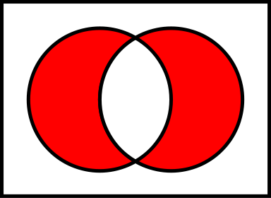

```{r setup, include=FALSE}
knitr::opts_chunk$set(echo = TRUE)
knitr::opts_chunk$set(warning = FALSE)
knitr::opts_chunk$set(collapse = TRUE)
knitr::opts_chunk$set(comment = NA)
knitr::opts_chunk$set(message = FALSE)
knitr::opts_chunk$set(fig.width = 6, fig.height = 4, fig.align = "center")
library(tidyverse)
options(digits = 7)
```

## Function forms

* *Everything that exists is an object*
* *Everything that happens is a function call*

There are four forms:

1. prefix: the function name comes before its arguments, e.g. foofy(a, b, c). The majority of functions class in R are in prefix form.

2. infix: the function name comes in between its arguments, like x `+` y. Infix forms are used for many mathematical operators, and for user-defined functions that begin and end with % such as %in% (the equivalent of SQL's IN operator).

3. replacement: functions that replace values by assignment, like names(df) <- c("a", "b", "c"). They actually look like prefix functions.

4. special: functions like [[, if, and for. While they don’t have a consistent structure, they play important roles in R’s syntax.

## Rewrting to prefix form

```{r}
# Infix to prefix
3 + 4
`+`(3, 4)
# Replacement to  prefix
names(mtcars) <- letters[1:11]
names(mtcars)
`names<-`(mtcars, letters[11:21])
names(mtcars)
# Special to prefix
for (i in 1:4) print(i)
`for`(i, 1:5, print(i))
```

---

## Prefix form

For prefix form, arguments can be specified in three ways:

* By position, like

```{r}
# The argument names are not used
sd(c(1:10, NA_real_), TRUE)
```

* By partial matching, such as

```{r}
# The argument names are not used
# Notice that the na.rm argument is only partially typed but R uses partial matching
sd(x = c(1:10, NA_real_), na. = TRUE)
```

* By exact name, as

```{r}
# Exact argument name
sd(x = c(1:10, NA_real_), na.rm = TRUE)
```

---

Function arguments are matched by exact name, then with unique prefixes, and finally by position, in that order:

```{r}
# Function
k01 <- function(abcdef, bcde1, bcde2) {
  list(a = abcdef, b1 = bcde1, b2 = bcde2)
}
# By position
str(k01(1, 2, 3))
# Exact name takes precedence over position
str(k01(2, 3, abcdef = 1))
# Can abbreviate long argument names using prefixes
str(k01(2, 3, a = 1))
```

**Partial matching is dangerous**. We can turn in into a warning.

```{r}
options(warnPartialMatchArgs = TRUE)
```

---

## Infix form

For infix forms, function names come in between their arguments, and hence, in most cases, they have two arguments. Some common infix functions or operators:

* `:` generates regular sequences from:to
* `::` and `:::` accesses exported and internal variables, i.e. R objects (including lazy loaded data sets) in a namespace. For a package `pkg`, `pkg::name` returns the value of the exported variable name in namespace `pkg`, whereas `pkg:::name` returns the value of the internal variable name
* `$` is the short-hand extract operator for x[["y"]]
* `@` extracts or replaces the contents of a slot in a object with a formal (S4) class structure
* Arithmetic operators such as `+`, `-`, `/`, `*`, `^`, matrix `%*%`, modulo `%%` (`%%` and x `%/%` y can be used for non-integer y, e.g. 1 `%/%` 0.2, but the results are subject to representation error and so may be platform-dependent)
* Logical operators such as `>`, `<`, `>=`, `<=`, `==`, `!=`, `!`, `&` and `&&` indicate logical AND and `|` and `||` indicate logical OR. The shorter form performs element-wise comparisons in much the same way as arithmetic operators. The longer form evaluates left to right examining only the first element of each vector. Evaluation proceeds only until the result is determined. The longer form is appropriate for programming control-flow and typically preferred in `if` clauses
* `~` tilde is used to separate the left- and right-hand sides in a model formula. This is a primitive function
* The operators `<-` and `=` assign into the environment in which they are evaluated
* `%in%` is a binary operator, which returns a logical vector indicating if there is a match or not for its left operand in the right operand--- x %in% table
* `%o%` is the outer-product of two arrays
* `%x%` computes the generalized Kronecker product of two arrays, x and y

---

The names of infix functions can contain any sequence of characters except for %. We need to escape any special characters in the string used to define the function, but not when we call it:

```{r}
# Define
`%myinfix\\%` <- function(a, b) paste(a, b)
# Call
"I" %myinfix\% "Rock"
```

R's default precedence rules dictate that infix operators are composed from left to right:

```{r}
# Infix
`%ken%` <- function(a, b) paste0("<", a, ",", b, ">")
# Test
# Evaluated from left to right
"3" %ken% "4" %ken% "6"
```

---

## Replacement functions

Replacement functions act like they modify their arguments in place, and have the special name "xxx<-." They must have arguments named "x" and "value," and must return the modified object. 

```{r}
# Define a replacement
`second<-` <- function(x, value) {
  x[[2]] <- value
  x
}
```

Replacement functions are used by placing the function call on the left side of <-:

```{r}
x <- 1:5
# Syntax
second(x) <- 9L
x
```

Behind the scenes R turns the syntax above to:

```{r}
x <- `second<-`(x = 1:5, value = 10L)
x
```

If the replacement function needs additional arguments, then they needs to be placed between x and value:

```{r}
# Additional argument
`modify<-` <- function(x, position, value) {
  x[[position]] <- value
  x
}
# Test
modify(x = x, position = 3) <- 2032L
x
```

---

## Special forms

Finally, there are a bunch of language features that are usually written in special ways, but also have prefix forms. These include parentheses:

* (x) (`(`(x))
* {x} (`{`(x)).

The subsetting operators:

* x[i] (`[`(x, i))
* x[[i]] (`[[`(x, i))

And the tools of control flow:

* if (cond) true (`if`(cond, true))
* if (cond) true else false (`if`(cond, true, false))
* for(var in seq) action (`for`(var, seq, action))
* while(cond) action (`while`(cond, action))
* repeat expr (`repeat`(expr))
* next (`next`())
* break (`break`())

Finally, the most complex is the function function:

* function(arg1, arg2) {body} (`function`(alist(arg1, arg2), body, env))

Knowing the name of the function that underlies a special form is useful for getting documentation: ?( is a syntax error; ?`(` will give you the documentation for parentheses. All these are implemented in C.

---

## Exercises

### Exercise 1

Rewrite the following code snippets into prefix form:

```{r}
# Infix
1 + 2 + 3
# Prefix
# The sum of 1 and 2 plus 3
`+`(`+`(1, 2), 3)
```

---

```{r}
# Infix
1 + (2 + 3)
# Prefix
# The sum of 2 and 3 plus 1
`+`(`+`(2, 3), 1)
```

---

```{r}
# Initialize variables
x <- sample(x = 1:10, size = 10)
n <- 7
# Special form
if (length(x) <= 5) x[[5]] else x[[n]]
# Prefix form
n <- 9
`if`(
  cond = `<=`(length(x), 5),
  true = `[[`(x = x, i = 5),
  false = `[[`(x = x, i = n)
)
```

---

### Exercise 2

Clarify the following list of odd function calls:

```{r}
# Before
set.seed(7)
sample(replace = TRUE, 20, x = c(1:10, NA))
# The argument names x and replace are matched
# Then, the position of 20 indicates that it is the size argument
set.seed(7)
sample(x = c(1:10, NA), size = 20, replace = TRUE)
```

---

```{r}
# Before
set.seed(17)
runif(min = 0, max = 1, 20)
# The arguments min & max are matched by name
# The argument n is out of order
set.seed(17)
runif(n = 20, min = 0, max = 1)
```

---

```{r}
# Define two vectors
x <- c(sample(x = 1:10, size = 5, replace = TRUE), NA_integer_)
y <- sample(x = 1:20, size = 6, replace = TRUE)
# Before
cor(m = "k", y = y, u = "p", x = x)
# Examine the arguments of the function "cor"
args(name = "cor")
# The arguments "m" is partially matched to "method"
# The argument input "k" for "method" is partially matched to "kendall"
# The arguments "u" is partially matched to "use"
# The argument input "p" for "use" is partially matched to "pairwise.complete.obs"
# The arguments x and y are out of order
cor(x = x, y = y, use = "pairwise.complete.obs", method = "kendall")
```

---

### Exericse 3

Explain why the following code fails:

`modify(get("x"), 1) <- 10`

R internally transforms the code above to the following:

```{r, eval=FALSE}
get("x") <- `modify<-`(x = get("x"), position = 1, value = 10)
```

The error occurs during the assignment because no corresponding replacement function, i.e. get<-, exists for get().

---

### Exercise 4

Create a replacement function that modifies a random location in a vector:

```{r}
# Function
`replaceken<-` <- function(x, value) {

  # Generate random location
  random <- sample(x = 1:length(x), size = 1)

  # Modify random element
  # Using prefix form of x[[i]] and x[[i]] <- value
  `<-`(`[[`(x = x, i = random), value)

  # Output
  x
}
# Test
x <- 1:9
# Call function
`replaceken<-`(x, value = 123L)
# Another way to call
replaceken(x = x) <- 342L
# Internally R transforms as follows
x <- `replaceken<-`(x = x, value = 342L)
```

---

### Exericse 5

Write your own version of + that pastes its inputs together if they are character vectors but behaves as usual otherwise. In other words, make this code work:

```{r}
# Infix form function
`%plus%` <- function(lhs, rhs) {

  # Warning
  if (typeof(lhs) != typeof(rhs)) rlang::abort(message = "Arguments must be same type")

  # Two cases
  if (is.numeric(lhs) == TRUE && is.numeric(rhs) == TRUE) {
    # Prefix form
    `+`(lhs, rhs)
  } else if (is_character(lhs) == TRUE && is_character(rhs) == TRUE) {
    # Paste if character
    # The function paste0(..., collapse) is equivalent to paste(..., sep = "", collapse)
    paste0(lhs, rhs)
  }
}
# Test
29304 %plus% 2321
"My" %plus% "Dog"
```

---

### Exercise 6

Create a list of all the replacement functions found in the {base} package. Which ones are primitive functions? (Hint use apropos())

```{r}
# Create a list of all replacement functions
replacement_functions <- as.list(apropos(what = "<-", where = TRUE, mode = "function"))
# Select only those from the base package
replacement_functions_base <- replacement_functions[names(replacement_functions) == length(search())]
# Select only those that are primitive
mget(
  x = as.character(replacement_functions_base),
  envir = baseenv()
) %>%
  Filter(f = rlang::is_primitive, x = .) %>%
  names()
```

---

### Exercise 7

What are valid names for user-created infix functions?

Valid names for use-created infix functions must start and end with %. Any combination of characters can be used in between (outside of % of course).

---

### Exercise 8

Create an infix `xor` operator. The function `xor` indicates element-wise exclusive OR. Exclusive or or exclusive dis-junction is a logical operation **that is true if and only if its arguments differ**:

```{r}
# Two equal vectors will result in false in all three elements
xor(x = c(TRUE, TRUE, FALSE), y = c(TRUE, TRUE, FALSE))
# The following will result in two TRUE's and one FALSE
# The first elements are the same while the second and third differ
xor(x = c(TRUE, FALSE, FALSE), y = c(TRUE, TRUE, TRUE))
```

Exclusive Or is TRUE in red:

```{r, out.height="60%", out.width="60%"}
# Import image

```


```{r}
# Examine the body of the operator
body(xor)
# Create the infix operator
`%xor%` <- function(x, y) {
  (x | y) & !(x & y)
}
# Test
c(TRUE, TRUE, TRUE) %xor% c(TRUE, TRUE, FALSE)
```

---

### Exercise 9

Create infix versions of the set functions intersect(), union(), and setdiff(). You might call them %n%, %u%, and %/% to match conventions from mathematics.

```{r}
# Check the function
intersect
# The asterisk means source code is not available
methods(generic.function = intersect)
# Intersection in infix form
`%n%` <- function(x, y) {

  # Ensure that x and y do not individually have duplicated values
  x <- unique(x)
  y <- unique(y)
  # Combine the vectors
  combined <- c(x, y)
  # The elements that are in both x and y are now duplicated
  # This is why we ensure that x & y do not individually have duplicated values
  logical_index <- duplicated(x = combined)
  # Subset using the logical index to extract only values that have duplicates
  combined[logical_index]
  # Now, the remaining set will be the intersection once we remove the duplicates
  intersection <- unique(x = combined[logical_index])

  # Output in order
  intersection[order(intersection, decreasing = FALSE)]
}
# Test
x <- sample(x = 1:50, size = 10, replace = FALSE)
y <- sample(x = 1:50, size = 25, replace = TRUE)
intersect(x = x, y = y)
x %n% y
```

---

```{r}
# Union in infix form
`%u%` <- function(x, y) {

  # Combine the vectors
  combined <- c(x, y)
  # The union is the combined save duplicates
  union <- unique(x = combined)

  # Output in order
  union[order(union, decreasing = FALSE)]
}
# Test
(union(x, y))[order(union(x, y), decreasing = FALSE)]
x %u% y
```

---

The function `setdif(x, y)` returns elements that are in x but not in y; the function `setdif(y, x)` returns all elements that are in y but not in x. This is a non-symmetric difference, which is order-dependent.

```{r}
# Example
x <- c(1, 3, 5, 6)
x
y <- c(1, 5, 9, 8, 7, 4, 2)
y
# This should return 3 and 6
setdiff(x, y)
# This should return 9, 8, 7, 4, and 2
setdiff(y, x)
```

---

```{r}
# Set difference
new_setdiff <- function(vector_1, vector_2, symmetry) {
  if (symmetry == TRUE) {

    # Find the union of x and y
    union_xy <- unique(c(x, y))
    # Find the intersection of x and y
    intersect_xy <- intersect(x, y)
    # Elements that are in the union but not in the intersection are the difference set
    # Recursive as it calls itself
    symmetric_diff <- new_setdiff(
      vector_1 = union_xy,
      vector_2 = intersect_xy,
      symmetry = FALSE
    )
    # Out put in order
    symmetric_diff[order(symmetric_diff, decreasing = TRUE)]
  } else {

    # Ensure that x and y do not individually have duplicated values
    x <- unique(vector_1)
    y <- unique(vector_2)
    # Find elements in x that are not in y (focus on vector_1 since it is supplied first)
    # This is TRUE when that x element is in y and FALSE when that x element in not in y
    logical_index <- x %in% y
    # Remove those x elements that are also in y
    # That is, we want the FALSE indices in "logical_index"
    set_diff <- x[!logical_index]
    # Output in order
    set_diff[order(set_diff, decreasing = TRUE)]
  }
}
```

---

```{r}
# Test
x <- sample(x = 1:20, size = 15, replace = TRUE)
y <- sample(x = 1:20, size = 15, replace = TRUE)
# Vector y first
(setdiff(y, x))[order(setdiff(y, x), decreasing = TRUE)]
new_setdiff(vector_1 = y, vector_2 = x, symmetry = FALSE)
# Vector x first
(setdiff(x, y))[order(setdiff(x, y), decreasing = TRUE)]
new_setdiff(vector_1 = x, vector_2 = y, symmetry = FALSE)
# Symmetric diff
new_setdiff(vector_1 = x, vector_2 = y, symmetry = TRUE)
setdiff(x = union(x, y), y = intersect(x, y))
```
