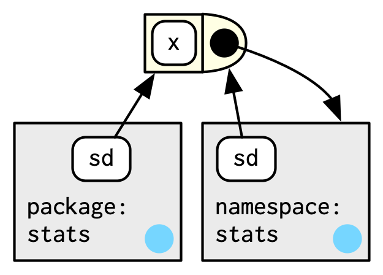

```{r setup, include=FALSE}
knitr::opts_chunk$set(echo = TRUE)
knitr::opts_chunk$set(warning = FALSE)
knitr::opts_chunk$set(comment = NA)
knitr::opts_chunk$set(message = FALSE)
knitr::opts_chunk$set(fig.width = 6, fig.height = 4, fig.align = "center")
library(rlang)
options(digits = 4)
```

# Package environments and the search path

Each package attached by `library()` or `require()` becomes one of the parents of the global environment. The immediate parent of the global environment is the last package one attaches. **Note**: A package is automatically loaded once we access one of its functions using ::, but it is only attached to the search path by `library()` or `require()`. The order in which every package has been attached is known as the   **search path** since all objects in these environments could be found from the top-level interactive work space. Some useful functions:

* To see all names of these environments, use `base::search()`:

```{r}
base::search()
```

* To see the environments themselves:

```{r}
rlang::search_envs()
```

The last two environments on the search path are always constant:

* The `Autoloads` environment uses delayed bindings to save memory by only loading package objects (such as built-in data sets) when they are accessed for the first time. In this fashion, R packages can provide data sets that behave like they are loaded in memory, even though they are only loaded from disk when needed.

* The base environment, `package:base`, is the environment of the base package, which can be accessed via `rlang::base_env()`.

Here is a diagram:

```{r, echo=FALSE}
knitr::include_graphics("Diagrams/search_path.png")
```

---

# The function environment

A **function environment** is an environment that binds the current environment, which is usually the global environment. Whens function is defined, a new environment is created. In the diagram below, the function is drawn as a rectangle with a rounded end that binds an environment:

```{r, echo=FALSE, fig.height=5, fig.width=6}
knitr::include_graphics("Diagrams/function_env.png")
```

In this diagram, `f()` binds the environment that binds the name `f` to the function. The function `f` creates a new environment inside the global environment. This environment has a frame, which has all the objects defined within the `{}` operator, and a pointer to the enclosing (parent) environment. The arguments for `f()` will be in the frame of this new environment created by the function `f`. When the function is executed, `f()` will find its variables in the execution environment but not the enclosing environment that it binds. This may not always be the case:

```{r, echo=FALSE, fig.height=5, fig.width=6}
knitr::include_graphics("Diagrams/function_env_2.png")
```

In the example above, the function `g()` is bound in a new environment whose parent is the global environment. However, `g()` does not bind this new environment (it does not have a pointer to this new environment in the diagram) and instead binds the global environment (points to the global environment). This distinction highlights a subtle but important distinction between binding and being bound by. There is a difference between how we as programmers find the function `g()` and how the function `g()` find its variables.

---

Functions that capture (or enclose) their environments are called **closures**. We can get the function environment with:

```{r}
# Create a binding from the name y to the double vector
y <- 1
# Define function
f <- function(x) {
  y <- 20
  x + y
}
# Get function environment
rlang::fn_env(f)
```

Notice how the the function `f()` finds its variables in the function environment. In base R, use `base::environment(fun)` to access the environment of a function.

---

# Namespaces

As the name suggests, **namespaces** provide “spaces” for “names”. They provide a context for looking up the value of an object associated with a name. For example, the double colon `::` operator--- it disambiguates functions with the same name. 

Both `plyr` and `Hmisc` provide a `summarize()` function. If one loads `plyr`, then `Hmisc`, `summarize()` will refer to the `Hmisc` version. But if one loads the packages in the opposite order, `summarize()` will refer to the `plyr` version. This can be confusing. Instead, one can explicitly refer to specific functions: `Hmisc::summarize()` and `plyr::summarize()`. Then the order in which the packages are loaded won’t matter.

---

Every function in a package is associated with a pair of environments--- the package environment and the **namespace** environment.

* The package environment is the external interface that determines how the R user finds a function in an attached package or with `::`. The parent of this environment is determined by search path, that is, the order in which packages have been attached.

* The namespace environment is the internal interface to the package. It controls how the function finds its variables.

```{r, echo=FALSE, fig.height=5, fig.width=6}

```

As can be seen in the diagram above, the function, represented by the rectangle with rounded end, is associated with two environments. Both the package and namespace environments bind the name "sd" to the function. In fact, every binding in the package environment can be found in the namespace environment; this ensures that every function can use every other function in the package. However, some bindings to **internal** or **non-exported** objects only occur in the namespace environment.  

---

Namespaces make packages self-contained in two ways: the **imports** and the **exports**. The imports defines how a function in one package finds a function in another. To illustrate, consider what happens when someone changes the definition of a function that you rely on. For example, the `simple nrow()` function in base R:

```{r}
nrow
```

It’s defined in terms of `dim()`. So what will happen if we override `dim()` with our own definition? Does `nrow()` break?

```{r}
dim <- function(x) c(1, 1)
dim(mtcars)
nrow(mtcars)
```

Surprisingly, it does not! That is  because when `nrow()` scopes for an object called `dim()`, it uses the package namespace, so it finds `dim()` in the base environment, not the `dim()` we created in the global environment.

The **exports** helps you avoid conflicts with other packages by specifying which functions are available outside of your package (internal functions are available only within your package and can’t easily be used by another package). Generally, you want to export a minimal set of functions; the fewer you export, the smaller the chance of a conflict. While conflicts aren’t the end of the world because you can always use `::` to disambiguate, they’re best avoided where possible.

---

Every namespace environment has the same set of ancestors:

* The imports environment that contains bindings to all the functions used by the package, which is controlled by the NAMESPACE file. See [R packages](https://r-pkgs.org/namespace.html) for more readings.

* The parent of the imports environment is the base namespace. The base namespace has the same bindings as the base environment (whose parent is the <env: empty> environment), but it has a different parent.

* The parent of the base namespace is the global environment, whose parents are the package environments.

```{r, echo=FALSE, fig.height=5, fig.width=6}
knitr::include_graphics("Diagrams/namespace_2.png")
```

In the diagram above, we use the `stats` package as an example. But every namespace environment for every package has the same set of ancestors: $\text{imports}\rightarrow\text{base namespace}\rightarrow\text{global}\rightarrow\text{package environments}\rightarrow...\rightarrow\text{base environment}\rightarrow\text{empty}$. A function is always scoped in a sequence of environments determined by the package developer through the **imports**. In addition, there is no direct link between the package and namespace environment except for the link defined by the function environments.

---

# Execution environments

Each time a function is called, an execution environment is created to host execution. Its parent is the function environment.

```{r}
# Define a function
h <- function(x) {
  # 1
  a <- 2 # 2
  x + a
}
# Create a binding from the name "y" to the object returned by the function
y <- h(x = 1) # 3
```

This can be shown graphically:

```{r, echo=FALSE, fig.height=3, fig.width=5}
knitr::include_graphics("Diagrams/execution1.png")
```

The diagram above has three parts (recall that the blue circle with an arrow indicates a link between an environment and its parent environment):

1. The bottom left box is the enclosing environment that binds the name "h" to the function. The function `h()`, represented by the rectangle with rounded end, binds this environment; that is, it has a pointer to this environment. When the function `h()` is called, an execution environment is created, as indicated by the box on the top. The environment contains the binding $x=1$.

2. The name "a" is bound to value 2 in the execution environment.

3. The function completes and a new binding is added to the enclosing environment that the function binds--- $y=3$. The execution environment is collected by the garbage collector.

---

There are two ways make the execution environment stay longer:

1. Explicitly return it:

```{r}
# Define a function
# The implicit value "a" is not returned since it is not the last evaluated expression
# The explicit value is returned instead
h2 <- function(x) {
  a <- x * 2
  # Explicitly return the execution env
  rlang::current_env()
}
# Execute the function and bind the returned object to a name
e <- h2(x = 10)
# Print the execution env
rlang::env_print(e)
```

As can be seen, the execution environment has to bindings--- "a" and "x". Its parent is the global environment, which the function environment binds. 

```{r}
# Get function env
rlang::fn_env(h2)
```

---

2. Another way to capture the execution environment is to return an object with a binding to that environment, like a function.

```{r}
plus <- function(x) {
  # The returned object is a first-class function
  function(y) x + y
}
```

This is a function factor, and it allows us to create other, varying functions by supplying varying arguments.

```{r}
plus_one <- plus(x = 1)
plus_one
```

As can be seen, the printed output includes the address to the execution environment of `plus`. The enclosing environment of `plus_one()` (i.e., the environment that the function `plus_one` binds to) is the execution environment of the function `plus`. This can all be seen in the graphics below:

```{r, echo=FALSE, fig.height=3, fig.width=5}
knitr::include_graphics("Diagrams/execution2.png")
```

In the diagram above, `plus_one()` is bound in the environment that `plus()` is bound by. However, whereas `plus()` binds the environment it bound by, `plus_one()` binds the execution environment of `plus()`. If we call `plus_one()`, its execution environment will have the captured execution environment of `plus()` as its parent:

```{r, echo=FALSE, fig.height=3, fig.width=5}
knitr::include_graphics("Diagrams/execution3.png")
```

See the blue arrow that points to the function environment of `plus_one()`, which points to the execution environment of `plus()`.

---

# Exercises

## Exercise 1

How is `search_envs()` different to `env_parents(global_env())`?

* Both return list objects of the environments:

```{r}
typeof(rlang::search_envs())
typeof(rlang::env_parents(env = rlang::global_env()))
```

* `search_envs()` returns all the environments on the search path, which is “a chain of environments containing exported functions of attached packages." Every time we attach a new package, this search path will grow. The search path ends with the base-environment. The global environment is included, because functions present in the global environment will always be part of the search path.

```{r}
rlang::search_envs()
```

* `rlang::env_parents(env = rlang::global_env())` only returns the ancestors of the global environment. Therefore the global environment itself is not included. This also includes the “ultimate ancestor,” the empty environment. This environment is not considered part of the search path because it contains no objects.

```{r}
rlang::env_parents(env = rlang::global_env())
```

---

## Exercise 2

Draw a diagram that shows the enclosing environments of this function:

```{r,eval=FALSE}
f1 <- function(x1) {
  f2 <- function(x2) {
    f3 <- function(x3) {
      x1 + x2 + x3
    }
    f3(3)
  }
  f2(2)
}
f1(1)
```


```{r, echo=FALSE, fig.height=6, fig.width=7}
knitr::include_graphics("Diagrams/special_env_exercise2.png")
```

In the diagram above, the enclosing environments can be explained as follows:

1. The environment that binds the name `f1` to the function environment is the global environment. This is the rectangular box on the bottom right. The function environment of `f1` binds the global environment.

2. When `f1` is called with $x1=1$, an execution environment is created with two bindings--- x1 and `f2` (the right-most rectangular box in the first row). The parent of this execution environment is the function environment of `f1`. The execution environment of `f1` is the enclosing environment of the function environment of `f2`.

3. When `f2` is called with $x2=2$, an execution environment is created with two bindings--- x2 and `f3` (the middle rectangular box in the first row). The parent of this execution environment is the function environment of `f2`. The execution environment of `f2` is the enclosing environment of the function environment of `f3`. 

4. Lastly, when `f3` is called with $x3=4$, an execution environment is created with *one* binding--- x3 (the left-most rectangular box in the first row). The parent of this execution environment is the function environment of `f3`. There is not `f4` and so this execution environment does not contain any bindings to another function object.

---

We can also inspect the binding of the environments by adding print statements to the function definition.

```{r}
f1 <- function(x1) {
  f2 <- function(x2) {
    f3 <- function(x3) {
      x1 + x2 + x3
      print("f3")
      print(env_print())
    }
    f3(3)
    print("f2")
    print(env_print())
  }
  f2(2)
  print("f1")
  print(env_print())
}

f1(1)
```

---

## Exercise 3

Write an enhanced version of `str()` that provides more information about functions. Show where the function was found and what environment it was defined in.

* Fist, we need to define a function that scopes for a function and returns the function object and the environment where it is found:

```{r}
fget <- function(name, env = rlang::caller_env(), inherits) {

  # If we do not need to check parents
  if (inherits == FALSE) {
    # Check if the empty env is reached
    if (identical(x = env, y = rlang::empty_env())) {
      stop("Cannot find function object", call. = FALSE)
      # If binding exists AND is a function, extract it
    } else if (rlang::env_has(env, nms = name)) {
      obj <- rlang::env_get(env = env, nm = name)

      # If the object is a function, return it plus the env, if not, do nothing
      if (rlang::is_function(obj)) {
        return(list("function" = obj, "environment" = env))
      }
      # If not found in current env, stop and throw an error
    } else {
      stop("Cannot find function object", call. = FALSE)
    }
  }

  if (inherits == TRUE) {
    # Check if the empty env is reached
    if (identical(x = env, y = rlang::empty_env())) {
      stop("Cannot find function object", call. = FALSE)
      # If binding exists AND is a function, extract it
    } else if (rlang::env_has(env, nms = name)) {
      obj <- rlang::env_get(env = env, nm = name)

      # If the object is a function, return it plus the env, if not, do nothing
      if (rlang::is_function(obj)) {
        return(list("function" = obj, "environment" = env))
      }
      # If not found, check parent
    } else {
      fget(name, env = rlang::env_parent(env), inherits = inherits)
    }
  }
}
```

* Next, the enhanced version of `str()`:

```{r}
str2 <- function(f) {

  # Scope for the function
  # This will throw an error if the function cannot be found
  fun <- fget(name = f, env = rlang::caller_env(), inherits = TRUE)

  # Return function object, its body, where it is found, what environment it was defined in
  list <- list(
    "Function" = fun[["function"]],
    "Where" = fun[["environment"]],
    # Cannot use the argument f directly since it is a character vector
    # The function rlang::fn_env() only  accepts functions as its arguments
    "Enclosed" = rlang::fn_env(fn = fun[["function"]])
  )

  # Output
  list
}
```

Let us see it in action:

```{r}
str2(f = "mean")
str2(f = "sum")
```

---

```{r}
rlang::env_unbind(env = rlang::global_env(), nms = base::names(rlang::global_env()))
```
