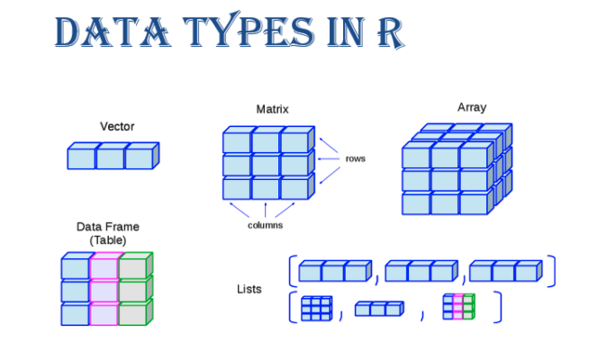

```{r setup, include=FALSE}
knitr::opts_chunk$set(echo = TRUE)
knitr::opts_chunk$set(warning = FALSE)
knitr::opts_chunk$set(collapse = TRUE)
knitr::opts_chunk$set(comment = NA)
knitr::opts_chunk$set(message = FALSE)
knitr::opts_chunk$set(fig.width = 6, fig.height = 4, fig.align = "center")
library(tidyverse)
library(Stat2Data)
options(digits = 7)
```

## Base functionals

```{r, out.height="70%", out.width="70%"}
# Import image

```

While `map()` and its variants are specialized to work with one-dimensional vectors, `base::apply(X, MARGIN, FUN, ..., simplify = TRUE)` is specialized to work with two or higher dimensional vectors. It can be thought of as an operation that summarizes a matrix or a array by collapsing each row or column to a single value.

* X, the matrix or array to summarize.

* MARGIN, an integer vector giving the dimensions to summarize over, 1 = rows, 2 = columns, etc. (The argument name comes from thinking about the margins of a joint distribution.)

* FUN, a summary function.

* ... other arguments passed on to FUN.

* simplify, a logical indicating whether results should be simplified if possible.

---

### Example 1

```{r}
# Matrix is a two-dimensional array
two_dim_array <- matrix(data = 1:20, nrow = 5)
# Test
is.array(two_dim_array)
two_dim_array
# Apply mean function to the rows
apply(
  X = two_dim_array,
  MARGIN = 1,
  FUN = mean
)
# This is equivalent to
mean(c(1, 6, 11, 16))
mean(c(2, 7, 12, 17))
mean(c(3, 8, 13, 18))
mean(c(4, 9, 14, 19))
mean(c(5, 10, 15, 20))
# Apply mean function to the columns
apply(
  X = two_dim_array,
  MARGIN = 2,
  FUN = mean
)
# This is equivalent to
mean(c(1, 2, 3, 4, 5))
mean(c(6, 7, 8, 9, 10))
mean(c(11, 12, 13, 14, 15))
mean(c(16, 17, 18, 19, 20))
```

---

### Example 2

```{r}
# Create a three-dimensional array
three_dim_array <- array(data = 1:24, dim = c(2, 3, 4))
three_dim_array
# Apply mean function to all rows
apply(
  X = three_dim_array,
  MARGIN = 1,
  FUN = mean
)
# This is equivalent to
mean(c(1, 3, 5, 7, 9, 11, 13, 15, 17, 19, 21, 23))
mean(c(2, 4, 6, 8, 10, 12, 14, 16, 18, 20, 22, 24))
# Apply mean function to the ij-th component in each of the 2d four matrices
apply(
  X = three_dim_array,
  MARGIN = c(1, 2),
  FUN = mean,
  simplify = FALSE
)
# This is equivalent to
# Mean of all four 1,1 entries
mean(c(1, 7, 13, 19))
# Mean of all four 1,2 entries
mean(c(3, 9, 15, 21))
# Mean of all four 1,3 entries
mean(c(5, 11, 17, 23))
# Mean of all four 2,3 entries
mean(c(2, 8, 14, 20))
# Mean of all four 2,2 entries
mean(c(4, 10, 16, 22))
# Mean of all four 2,3 entries
mean(c(6, 12, 18, 24))
# Output structure
str(apply(
  X = three_dim_array,
  MARGIN = c(1, 2),
  FUN = mean,
  simplify = FALSE
))
# Output type
is.array(apply(
  X = three_dim_array,
  MARGIN = c(1, 2),
  FUN = mean,
  simplify = FALSE
))
```

Do not use `apply()` with data frames as it coerces the data frame to a matrix, which may be undesirable at times.

---

## Mathematical functionals

Functionals are very common in mathematics. The limit, the maximum, the roots (the set of points where f(x) = 0), and the definite integral are all functionals: given a function, they return a single number (or vector of numbers). 

Base R provides a useful set:

* `integrate(f, lower, upper, ..., subdivisions = 100L)` finds the area under the curve defined by f()
* `uniroot(f, interval, ...)` finds where f() hits zero
* `optimize(f, interval, ..., maximum = FALSE)` finds the location of the lowest (or highest) value of f()

---

## Exercises

### Exercise 1

How does apply() arrange the output? Read the documentation and perform some experiments:

If each call to FUN returns a vector of length n, and simplify is TRUE, then apply returns an array of dimension c(n, dim(X)[MARGIN]) if n > 1. If n equals 1, apply returns a vector if MARGIN has length 1 and an array of dimension dim(X)[MARGIN] otherwise. If n is 0, the result has length 0 but not necessarily the ‘correct’ dimension.

If the calls to FUN return vectors of different lengths, or if simplify is FALSE, apply returns a list of length prod(dim(X)[MARGIN]) with dim set to MARGIN if this has length greater than one.

---

Basically apply() applies a function over the margins of an array. In the two-dimensional case, the margins are just the rows and columns of a matrix. Let’s make this concrete.

```{r}
arr2 <- array(1:12, dim = c(3, 4))
rownames(arr2) <- paste0("row", 1:3)
colnames(arr2) <- paste0("col", 1:4)
arr2
```

When we apply the head() function over the first margin of arr2() (i.e. the rows), the results are contained in the columns of the output, transposing the array compared to the original input.

```{r}
apply(arr2, 1, function(x) x[1:2])
```

And vice versa if we apply over the second margin (the columns):

```{r}
apply(arr2, 2, function(x) x[1:2])
```

The output of apply() is organised first by the margins being operated over, then the results of the function. This can become quite confusing for higher dimensional arrays.

---

### Exercise 2

What do `eapply()` and `rapply()` do? Does purrr have equivalents?

* `eapply(env, FUN, ..., all.names = FALSE, USE.NAMES = TRUE)` applies FUN to the named values from an environment and returns the results as a list. The user can request that all named objects are used (normally names that begin with a dot are not). The output is not sorted and no enclosing environments are searched

  + all.names is a logical indicating whether to apply the function to all values
  
  + USE.NAMES is a logical indicating whether the resulting list should have names

* `rapply(object, f, classes = "ANY", deflt = NULL, how = c("unlist", "replace", "list"), ...)` applies a function to all elements of a list recursively. This function makes it possible to limit the application of the function to specified classes (default classes = ANY). One may also specify how elements of other classes should remain: as their identity (how = replace) or another value (default = NULL). The closest equivalent in purrr is modify_depth(), which allows you to modify elements at a specified depth in a nested list

---

### Exercise 3

A number $x$ is called a fixed point of a function $f$ if it satisfies the equation $f(x) = x$. For some function $f$, we may find a fixed point by beginning with a starting value and applying f repeatedly

\begin{align*}
f(x), f(f(x)), f(f(f(x))), \ldots
\end{align*}

until the value does not change very much. Using this idea, we can devise a **[fixed-point algorithm](https://mitpress.mit.edu/sites/default/files/sicp/full-text/book/book-Z-H-12.html#%25_idx_1096)**\footnote{Click for link.} that takes as inputs a function $f$ and an initial guess $x$, producing an approximation to a fixed point of the function. We apply the function *repeatedly* until we find two successive values whose difference is *less than some prescribed tolerance*. Here `fixed_point()` acts as a functional because it takes a function as an argument:

### Implementation

```{r}
fixed_point <- function(f, x_initial, n_max = 10000, tol = 0.0001) {

  # Initialize the number of attempts
  n <- 0
  # Initialize initial guess
  x <- x_initial
  # Initialize first output
  y <- f(x)

  # A function to check if fixed-point is found
  is_fixed_point <- function(x, y) {
    abs(x - y) < tol
  }

  # While loop
  # First, if !is_fixed_point(x, y) evaluates to TRUE, keep searching
  # If False, which means the fixed-point is found, then end of loop
  while (!is_fixed_point(x, y)) {

    # Now the output becomes the new input
    x <- y
    # The new output
    y <- f(y)

    # Stop condition in case the fixed-point search does not converge ever
    # Each iteration, add 1 to the counter for the number of attempts
    n <- n + 1
    # If we reach 10,000 attempts and still does not find the fixed-point
    # Stop the loop
    if (n > n_max) {
      stop("The fixed-point search fails to converge.", call. = FALSE)
    }
  }

  # Output
  x
}
```

---

### Test

Converges:

```{r}
fixed_point(f = sin, x_initial = 1)
fixed_point(cos, x_init = 1)
```

Fails to converge:

```{r, eval=FALSE}
add_one <- function(x) x + 1
fixed_point(add_one, x_init = 1)
```
